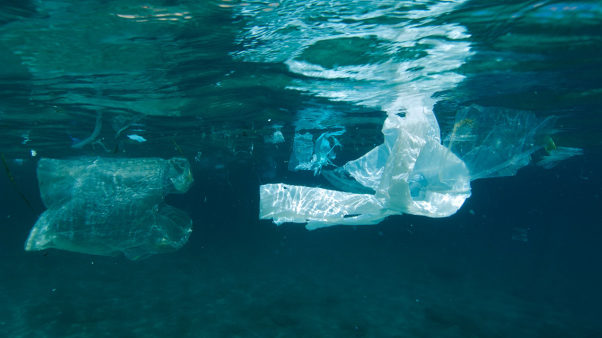
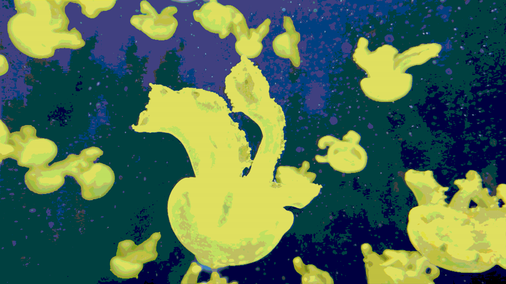

## Creative Coding 2: Custom Pixel
## Name: Evelyn Lee

_____________________________________________________________________________________________________

Due to complications with my last project, I was set back on the progress of this one and so I didn't start with much of a plan. For the majority of the first half within this project, I didn't get how the process was suppose to work or what I can even do. Eventually I understood some of the ideas and shifted my focus on photos displaying jellyfish. 

Midway, I was given the suggestion of adding photos of plastic bags in the ocean to the system as it would be interesting what the outcome would look like. The posterization and scanlines veiling the main subjects were suppose to reflect on the polluted oceans and how sea turtles end up mistaking plastic bags for jellyfish.

