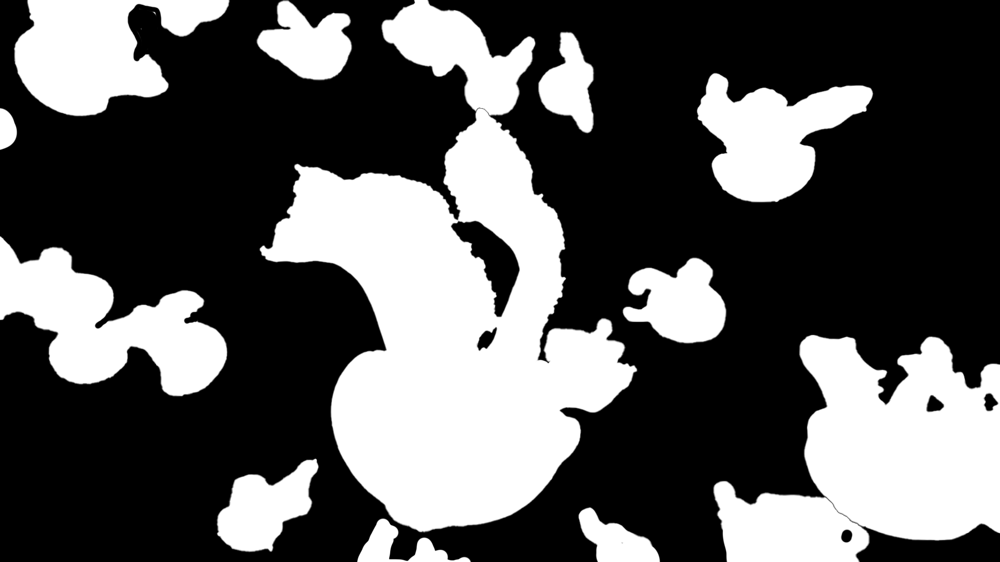

## Creative Coding 2: Custom Pixel
## Name: Evelyn Lee

_____________________________________________________________________________________________________

Mid-way through the project, I realized it would be difficult to replicate the style accurately due to the given parameter limit. Since I was using bezier vertex shapes to create the ink strokes, I would have to use a larger amount of parameters if I wanted to replicate the varying bends. 

